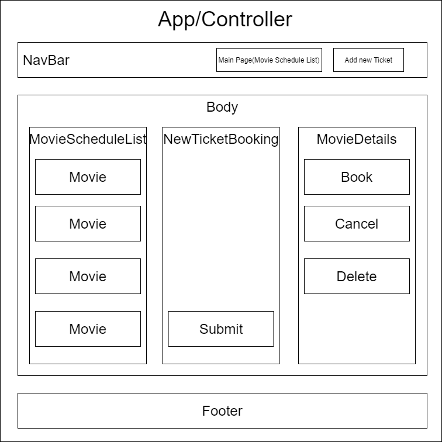

<!-- npm install axios    
npm install react-router-dom
npm install bootstrap -->

# Movie Ticket Booking :movie_camera:

#### A movie ticket booking site with full CRUD functionality 4.24.2020

#### By Jiwon Han**

[](https://www.repostatus.org/#wip)


[](https://lbesson.mit-license.org/)


## 1. User Flow

This is a movie ticket booking site with create/read/update/delete functionality. A desirable user would be a administrator or employee of movie theater.

1. A user is able to receive movie data from movie API.
2. A user is able to choose employee mode in the first web page.
3. A user is able to create new movie in the system and that is added to a movie list.
4. A user is able to see all movies list in the main page.
5. A user is able to check each movie's detail in detail page.
6. A user is able to book or cancel the ticket in booking page.
7. A user is able to update ticket status as per reservation or cancellation.
8. When tickets are sold out(ticket quantities are equal to 0), the "Out of stock" message is shown.
9. Ticket quantities are limited to 8, so system notifies a user that limited ticket quantities when canceling tickets and ticket numbers reach 8.
10. A user is able to delete a movie in detail page and the movie is excluded in the movie list in main page.

### Future improvements

1. Database such as firebase

### Diagram

1. 1st plan


<!-- App has NavBar and BubbleTeaControl and Footer components comprehensively. BubbleTea control is a global component for BubbleTeaList, NewBubbleTeaForm and BubbleTeaDetail components. Those children components could connect via their parent control.  -->

### Sreenshot

<!--  -->

## 2. Development
### Tech stack:
+ [NPM](https://www.npmjs.com/) for package management
+ [react](https://reactjs.org/) as core stack
+ [Movie API](https://yts.mx/api)
+ [drawio](https://app.diagrams.net/) for diagram
+ [bootstrap](https://getbootstrap.com/)
+ [favicon](https://www.favicon-generator.org/) for a bubble tea favicon

### To run dev mode locally:
```bash
  $ git clone https://github.com/jiwon-seattle/Movie-ticket-booking.git
  $ cd movie-ticket
  $ npm install  
  # After successfull pkg installtion
  $ npm start
```
Now, it will automatically open http://localhost:3000 and show you movie ticket site.

## 3. Known Bugs

There are no known bug at this moment

## 4. Support and contact details

Any feedback is appreciated! Please contact at email: jiwon1.han@gmail.com

### License

*This software is licensed under the MIT license*

Copyright (c) 2020 **_Jiwon Han_**
