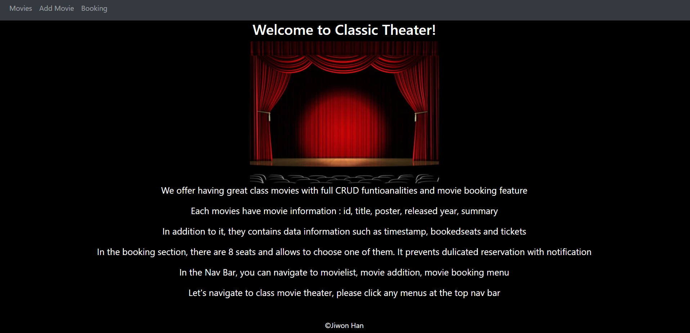
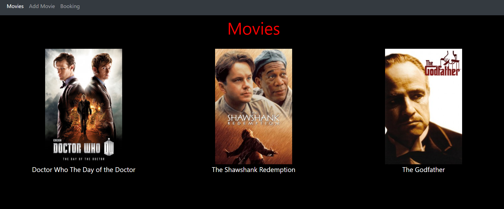
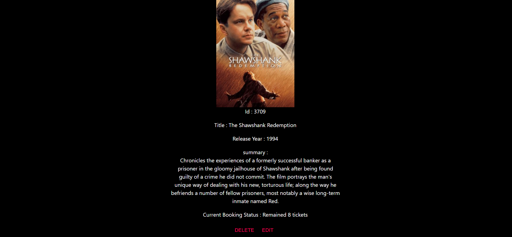
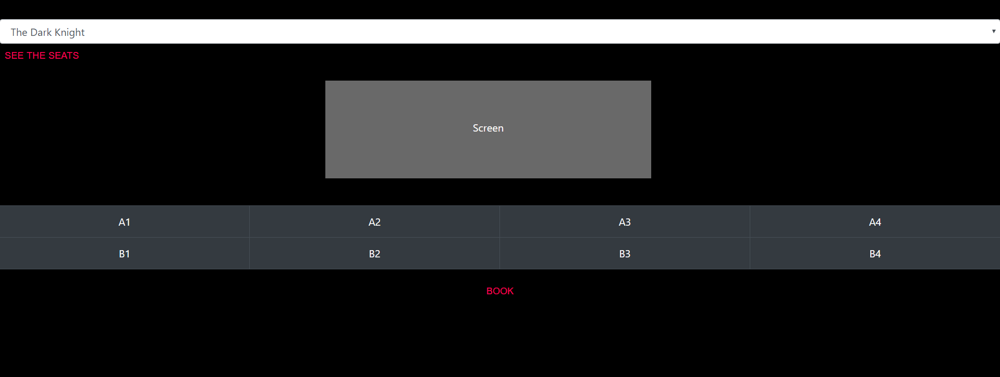

# Movie Ticket Booking site :movie_camera:

#### A movie data management and booking site with full CRUD functionality 5.3.2020

#### By Jiwon Han

[](https://www.repostatus.org/#wip)


[](https://lbesson.mit-license.org/)

**This application was developed by react-redux.**

## 1. User Flow

This is a movie ticket booking site with create/read/update/delete functionality. There are main feature : **movie management** and **movie booking**. 

1. A user is guided to the site at the first initial page.
1. A user is able to navigate the site through nav bar.
2. A user is able to see a movie list.
3. A user clicks a specific movie and page turns to movie detail page.
4. A user is able to see movie information in detailed.
5. A user is able to delete the movie in the detail page.
6. A user is able to update the movie clicked by `EDIT` in the movie detail page.
7. A user is able to add a new movie clicked by  `Add Movie` at the nav bar.
8. A new movie is created with timestamp.
9. A user is able to navigate to Booking page.
10. A user is able to choose a movie on the drop down menu to make a reservation.
11. A movie screen and seat information comes up.
12. A user is able to choose a seat and if seat is already booked, `Already booked` message is shown.
13. After booking, a user is able to check ticket amounts decreased in the movie detail page. 

### Diagram

1. 1st plan : before redux, react only


<!-- App has NavBar and BubbleTeaControl and Footer components comprehensively. BubbleTea control is a global component for BubbleTeaList, NewBubbleTeaForm and BubbleTeaDetail components. Those children components could connect via their parent control.  -->

2. react-redux plan


### Sreenshot










### What's Included

```bash 
|-- _tests_ :
|-- actions :
|   |-- actions.jsx
|   |-- fetchData.jsx
|-- components :
|   |-- App.jsx
|   |   |-- Nav/Main/Footer
|   |-- App.css
|   |-- Footer.jsx
|   |-- Intro.jsx
|   |-- Booking
|   |   |-- Booking.jsx
|   |   |-- Booking.css
|   |-- Movie
|   |   |-- Control.jsx
|   |   |-- Movie.jsx
|   |   |-- MovieAdd.jsx
|   |   |-- MovieEdit.jsx
|   |   |-- MovieInfo.jsx
|   |   |-- MovieList.jsx
|   |   |-- Movie.css
|-- reducers :
|   |   |-- reducer.js
|-- history.jsx
|-- index.jsx
```
**All components were descripted with propTypes**

### Future improvements

1. Database such as firebase
2. Server

## 2. Development

### Tech stack:

+ [NPM](https://www.npmjs.com/) for package management
+ [react](https://reactjs.org/), [react-redux](https://react-redux.js.org/) as core stack
+ [Movie API](https://yts.mx/api)
+ [drawio](https://app.diagrams.net/) for diagram
+ [bootstrap](https://getbootstrap.com/)
+ [favicon](https://www.favicon-generator.org/) 

### To run dev mode locally:

```bash
  $ git clone https://github.com/jiwon-seattle/Movie-Booking-Site.git
  $ cd the repository
  $ npm install  
  # After successfull pkg installtion
  $ npm start
```
Now, it will automatically open http://localhost:3000 and show you movie ticket site

_If you encouter with initial npm packages issues, please delete `package-lock.json` file in the directory_

### Packages used

`react` `react-redux` `react-bootstrap` `react-dom` `react-router-dom` `react-scripts` `redux` `axios`

## 3. Known Bugs

There are no known bug at this moment

## 4. Support and contact details

Any feedback is appreciated! Please contact at email: jiwon1.han@gmail.com

### License

*This software is licensed under the MIT license*

Copyright (c) 2020 **_Jiwon Han_**
